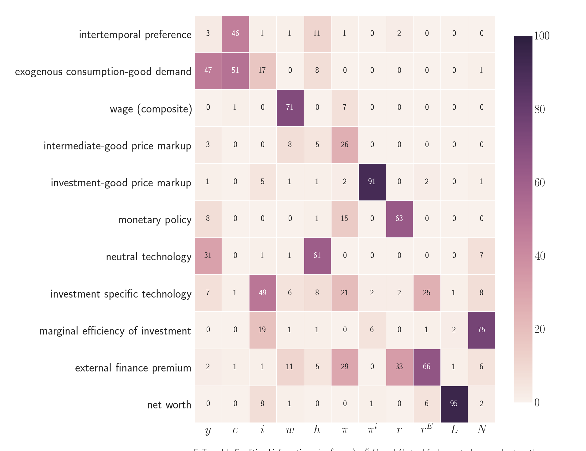

  

      <ul class="nav">
          <li><a href="SW_fig1.html">prev</a></li>
          <li><a href="iskrev2017_fig1.html">next</a></li>
      </ul>
  

Conditional information gains in Kaihatsu and Kurozumi (2014). An application of the methodology of **Iskrev N.** *Are asset price data informative about news shocks? A DSGE perspective*

**Figure**. &mdash; Information gains in the model of *Sources of business fluctuations: Financial or technology shocks?* by Kaihatsu S. and Kurozumi T.
