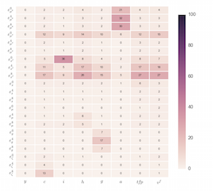

  

      <ul class="nav">
          <li><a href="geneticmaps_fig3.html">prev</a></li>
          <li><a href="iskrev2017_fig2.html">next</a></li>
      </ul>
  

**Figure 1**. &mdash; Conditional information gains at the MLE of SGU (2012).
