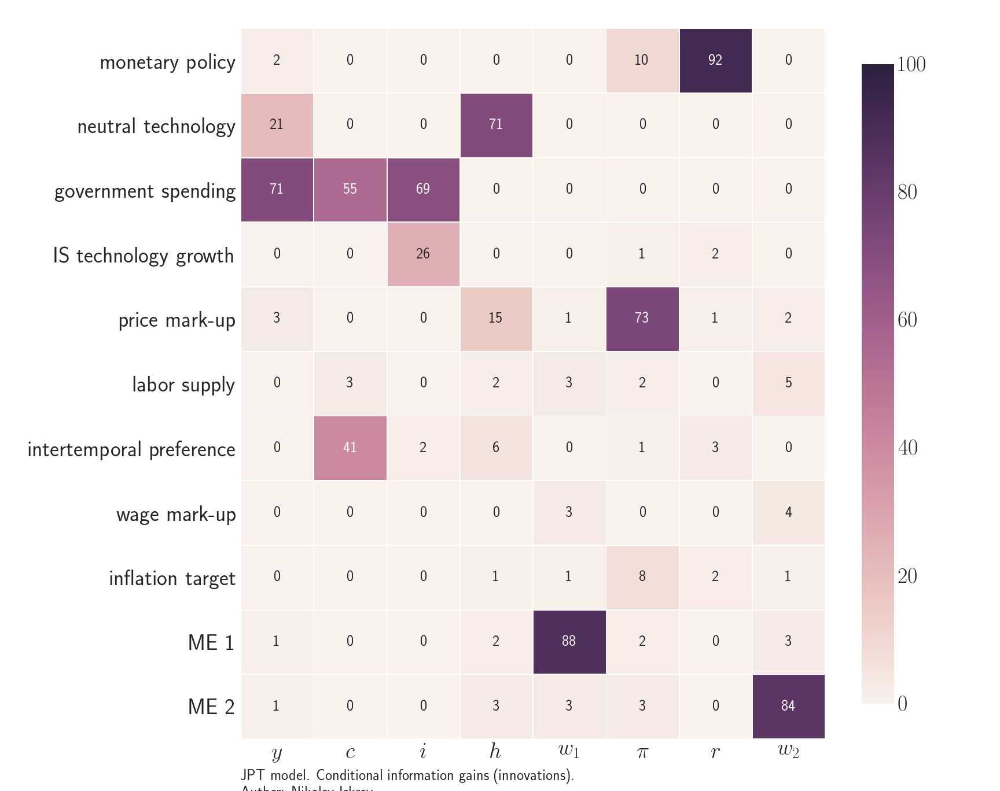

  

      <ul class="nav">
          <li><a href="FoT-model-fig1.html">prev</a></li>
          <li><a href="iskrev2017_fig2.html">next</a></li>
      </ul>
  

Justiniano, Primiceri, and Tambalotti (2013) *Is there a Trade-Off between Inflation and Output Stabilization?*

**Figure 1**. &mdash; Conditional information gains in JPT (2013).
