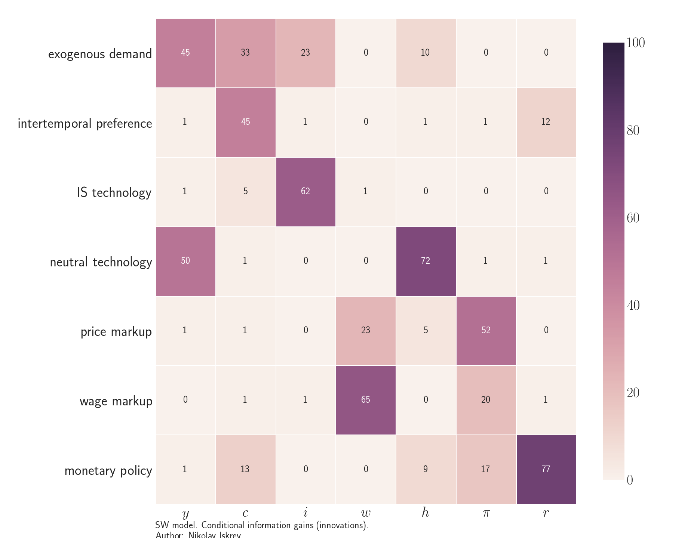

  

      <ul class="nav">
          <li><a href="iskrev2017_fig4.html">prev</a></li>
          <li><a href="FoT-model-fig1.html">next</a></li>
      </ul>
  

Smets and Wouters (2007) *Shocks and frictions in US business cycles: A Bayesian DSGE approach*

**Figure 1**. &mdash; Conditional information gains in SW (2007).
