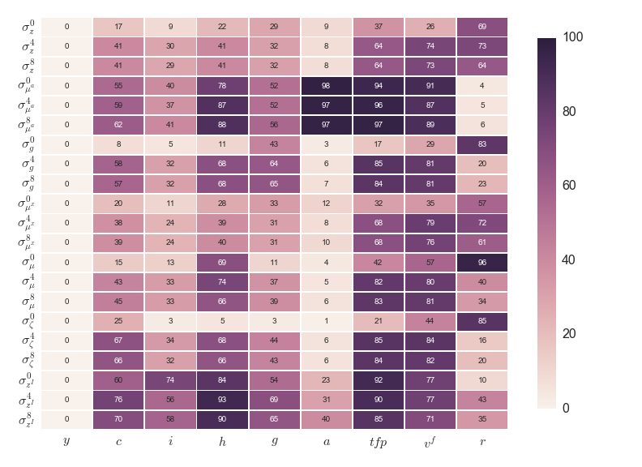

  

      <ul class="nav">
          <li><a href="iskrev2017_fig3.html">prev</a></li>
          <li><a href="iskrev2017_fig1.html">next</a></li>
      </ul>
  

Iskrev N. Are asset price data informative about news shocks? A DSGE perspective.

**Figure 4**. &mdash; Efficiency gains in the model of Avdjiev (2016).
